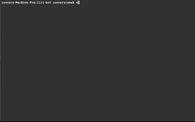
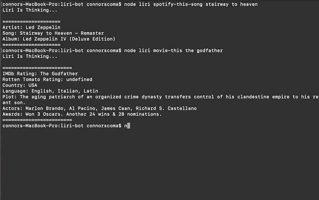

# LIRI Bot

**Clone**
``` git clone https://github.com/ConnorScoma1/LIRI-Bot.git ```

**NPM Install**
``` npm install ``` 

## Required Assets
* Spotify
* Axios
* Request
* FS
* Moment

### API Keys
	These are in a different file called key.js
	
		exports.spotify  = {
			id:  'ID_API_KEY',
			secret:  'SECRET_API_KEY'
		} 


## How to Use Liri

|APIs            |NODE Arrgument                 |Output/Callback              |
|----------------|-------------------------------|-----------------------------|
|OMDb            |`node Liri Movie-This`         |Movie Info                   |
|Spotify         |`node Liri Spotify-This-Song`  |Song Info                    |
|Bands In Town   |`node Liri Concert-This`       |Concert Info                 |


## Spotify In Action


## OMDb In Action


## Bands In Town In Action
